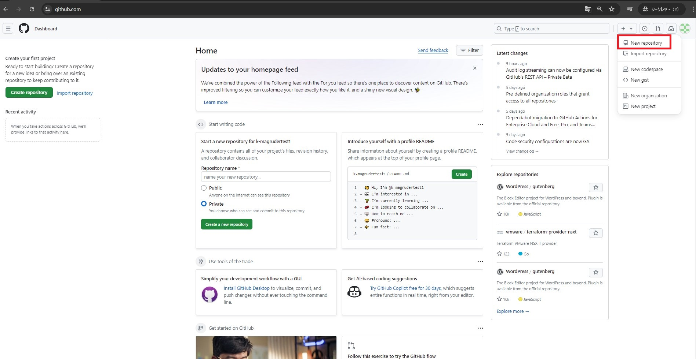

ここでは、Repositoryの作成とファイルの追加、既存のファイルの編集までを行います。  
*ハンズオンの手順の参照とハンズオンの実施は、ブラウザで別タブか別ウィンドウを開いて行うことをおすすめします。

## 1. Repositoryの作成

1. https://github.com にアクセスした状態で、画面右上にある「＋」をクリックし、「New repository」をクリックします。



2. 「Repository name」に `github-training` と入力します。(Owrnerは、ご自身のユーザスペースorユーザアカウントを選択してください。)
3. 「Public」が選択されていることを確認します。
4. 「Initialize this repository with:」の、「Add a README file」にチェックを入れます。
5. 「Create repository」をクリックします。


6. 以下のように「github-training」というRepositoryが表示されていればokです。

## 2. ファイルの追加

1. 「github-training」というRepositoryで作業します。
2. 画面の左上タブの「<> Code」が選択されていることを確認してください。
3. 「Add file」をクリックし、「+ Create new file」をクリックします。


4. 「Name your file」に `hellow-world.txt` と入力します。
5. 「Enter file contents here」に以下のスニペットを入力します。(任意の内容を入力していただいても構いません)

```
# Hellow World.

Hellow World.

## Hellow World.

Hellow World.

### Hellow World.

Hellow World.
```

6. 追加するファイルの入力を終えたら、画面右上の「Commit changes...」をクリックします。
7. 「Commit directly to the main branch」が選択されていることを確認します。
8. 「Commit changes」をクリックします。


9. 画面の左上タブの「<> Code」を一度クリックします。
10. 「github-training」というRepositoryに「hellow-world.txt」というファイルが追加されたことが確認できます。


## 3. 既存のファイルの編集

1. 「github-training」というRepositoryで作業します。
2. 画面の左上タブの「<> Code」が選択されていることを確認してください。(一度「<> Code」をクリックすれば確実です)
3. 「README.md」をクリックします。


4. 画面右上の鉛筆マークをクリックします。


5. 以下のスニペットを追加します。(任意の内容を入力していただいても構いません)

```
This is a first time editing the file.
```

6. 追加するファイルの入力を終えたら、画面右上の「Commit changes...」をクリックします。
7. 「Commit directly to the main branch」が選択されていることを確認します。
8. 「Commit changes」をクリックします。


9. 画面の左上タブの「<> Code」を一度クリックします。
10. 「github-training」というRepositoryに存在する「README.md」というファイルが編集されたことが確認できます。
