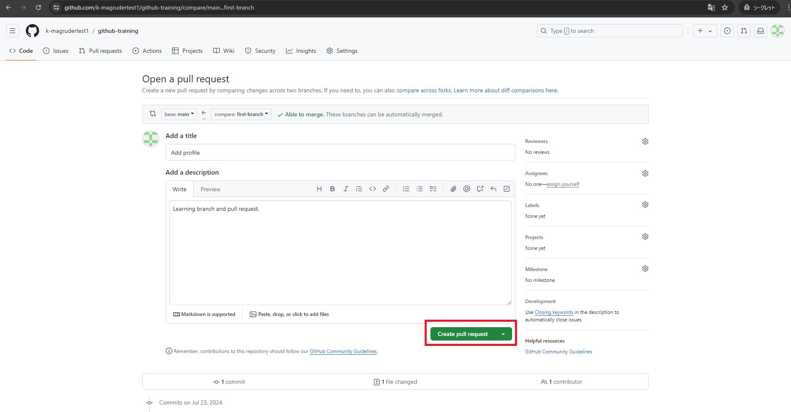

ここでは、branchの作成、ファイルの追加、pull requestの作成、作成したブランチに実施した変更内容をmainブランチへマージまでを行います。  
*ハンズオンの手順の参照とハンズオンの実施は、ブラウザで別タブか別ウィンドウを開いて行うことをおすすめします。

## 1. branchの作成

1. 「github-training」というRepositoryで作業します。
2. 画面の左上タブの「<> Code」が選択されていることを確認してください。
3. 「main」と表示されている部分をクリックします。
4. 「Find or create a branch」に `first-branch` と入力します。
5. 「Create branch *first-branch* from *main*」をクリックします。


## 2. 作成したbranchにてファイルを追加

1. 「github-training」というRepositoryで作業します。
2. 画面の左上タブの「<> Code」が選択されていることを確認してください。
3. 「first-branch」が選択されていることを確認してください。
4. 「Add file」をクリックし、「+ Create new file」をクリックします。


5. 「Name your file」に `PROFILE.md` と入力します。
6. 「Enter file contents here」に以下のスニペットを入力します。(任意の内容を入力していただいても構いません)

```
Welcome to my GitHub Profile!
```

7. 追加するファイルの入力を終えたら、画面右上の「Commit changes...」をクリックします。
8. 「Commit message」に `Add profile` と入力します。
9. 「Extended description」に `Learning branch and pull request.` と入力します。
10. 「Commit directly to the first-branch branch」が選択されていることを確認します。
11. 「Commit changes」をクリックします。


## 3. pull requestの作成

1. 「github-training」というRepositoryで作業します。
2. 画面の左上タブの「Pull requests」をクリックします。


3. 「New pull request」をクリックします。


4. 「Compare changes」で、「compare: main」と表示されている箇所をクリックします。
5. 「first-branch」をクリックします。


6. 「Create pull request」をクリックします。


7. 「Create pull request」をクリックします。



## 4. 変更内容をマージ

1. 「github-training」というRepositoryで作業します。
2. 画面の左上タブの「Pull requests」が選択されていることを確認してください。
3. 「Merge pull request」をクリックします。


4. 「Confirm merge」をクリックします。


5. 「Delete branch」をクリックします。


6. 画面の左上タブの「<> Code」を一度クリックします。
7. 「github-training」というRepositoryに「PROFILE.md」というファイルが追加されたことが確認できます。
