ここでは、issueの作成、Projectボードの作成、issueをProjectボードに紐づけるまでを行います。  
*ハンズオンの手順の参照とハンズオンの実施は、ブラウザで別タブか別ウィンドウを開いて行うことをおすすめします。

## 1. issueの作成

1. 「github-training」というRepositoryで作業します。
2. 画面の左上タブの「Issues」をクリックします。
3. 「New issue」をクリックします。

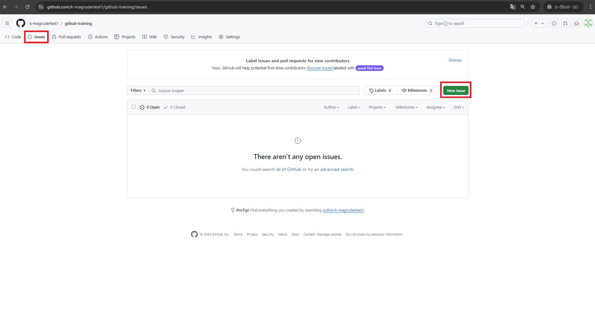

4. 「Title」に `Wikiの作成` と入力します。
5. 「Submit new issue」をクリックします。

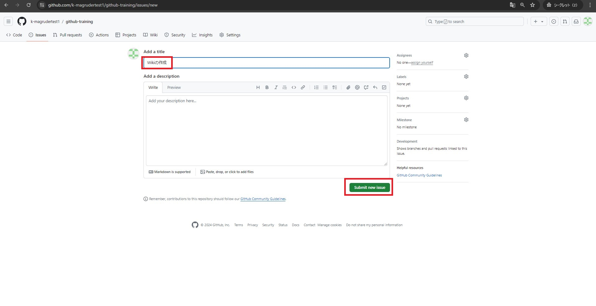

6. 先の手順同様に、`tagの作成とreleaseの作成` と `GitHub Pagesの作成` と `GitHub Actionsの作成` という名前のissueを3つ作成します。

## 2. Projectボードの作成

1. 「github-training」というRepositoryで作業します。
2. 画面の左上タブの「Projects」をクリックします。
3. 「Link a project」の横の「▽」をクリックします。
4. 「New project」をクリックします。

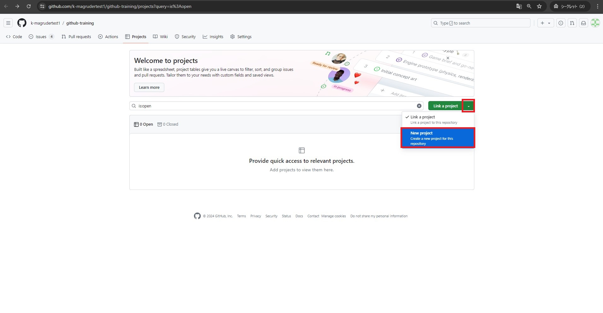

5. 「New project」をクリックします。

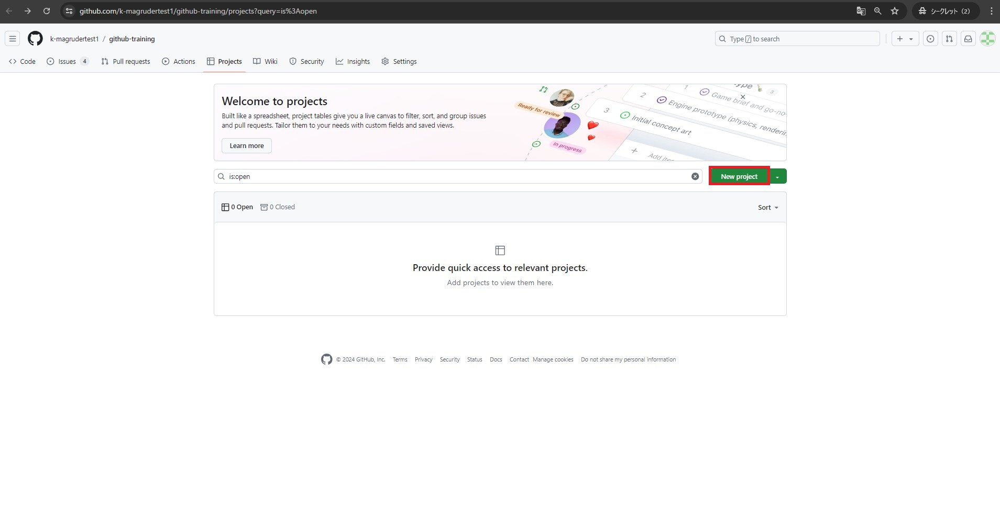

6. 「Board」をクリックします。

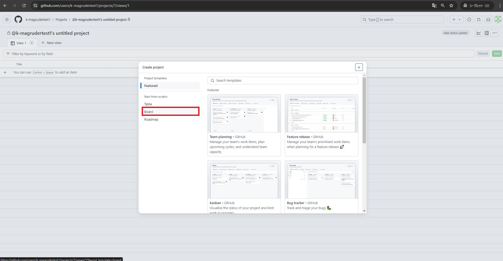

7. 「Project name」に `Todo list` と入力します。
8. 「Create project」をクリックします。

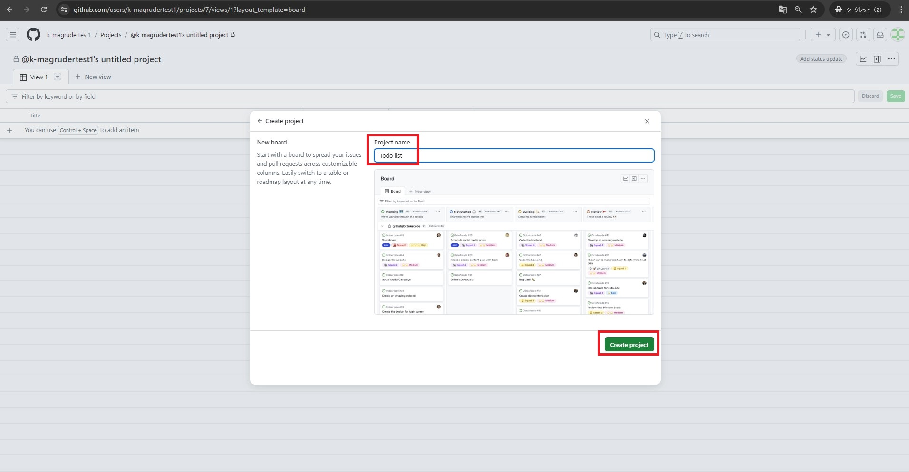

## 3. issueをProjectボードに紐づける

1. 「Todo」のリストに下に表示されている「+ Add item」をクリックします。

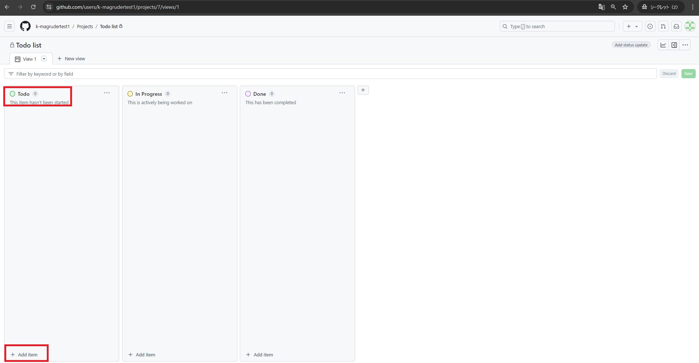

2. 「+」をクリックします。

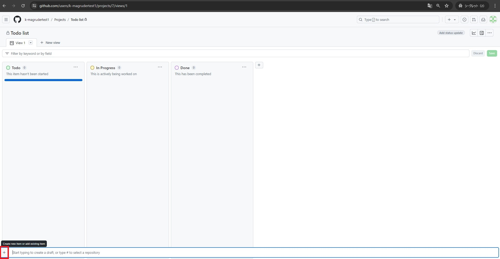

3. 「Add item from repository」をクリックします。

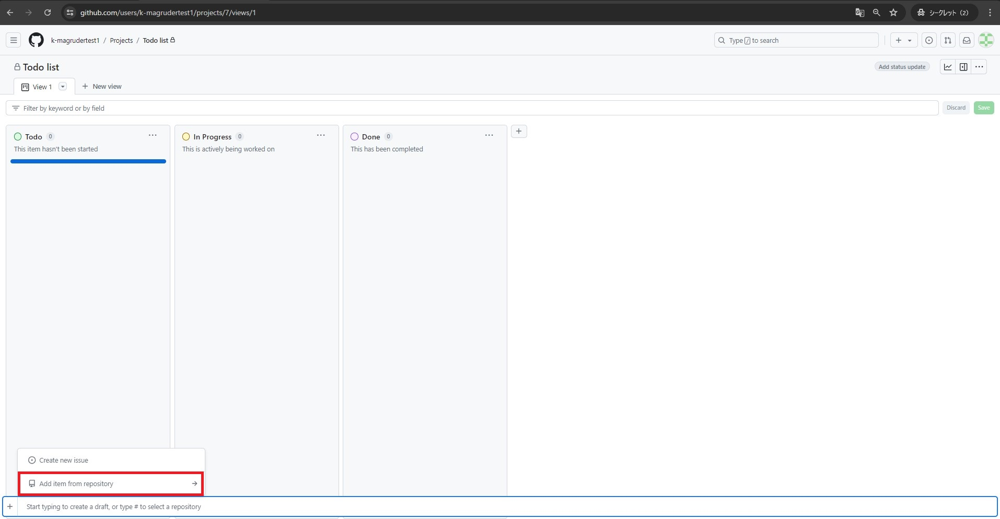

4. 「github-training」が選択されていることを確認します。
5. 「Wikiの作成」「tagの作成とreleaseの作成」「GitHub Pagesの作成」「GitHub Actionsの作成」の4つのissueにチェックを入れます。
6. 「Add selected items」をクリックします。

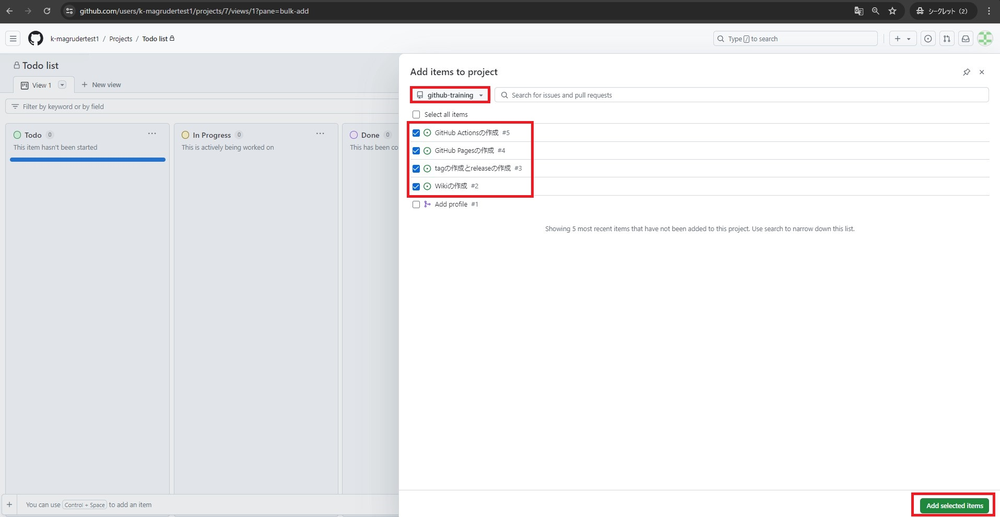

6. 「×」印をクリックします。

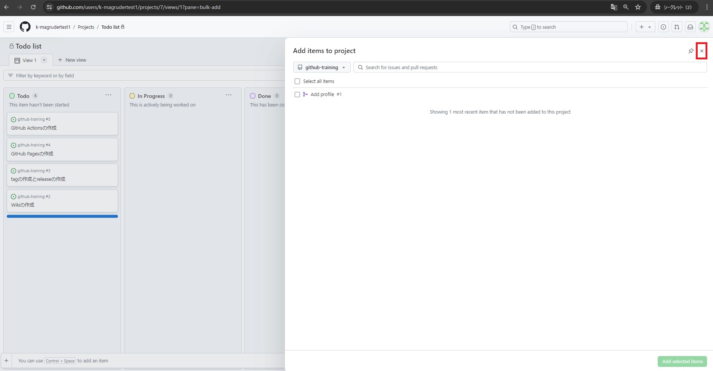

7. 「Todo」のリストに4つのissueが追加されたことを確認します。

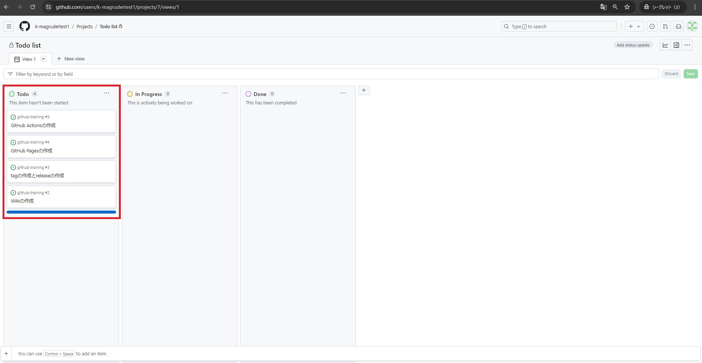

8. 画面右上のご自身のプロファイル(アイコン)をクリックします。

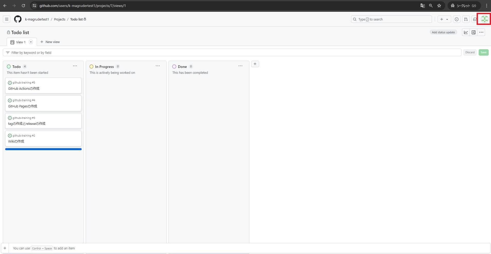

9.  「Your repositories」をクリックし、「github-training」というRepositoryをクリックします。

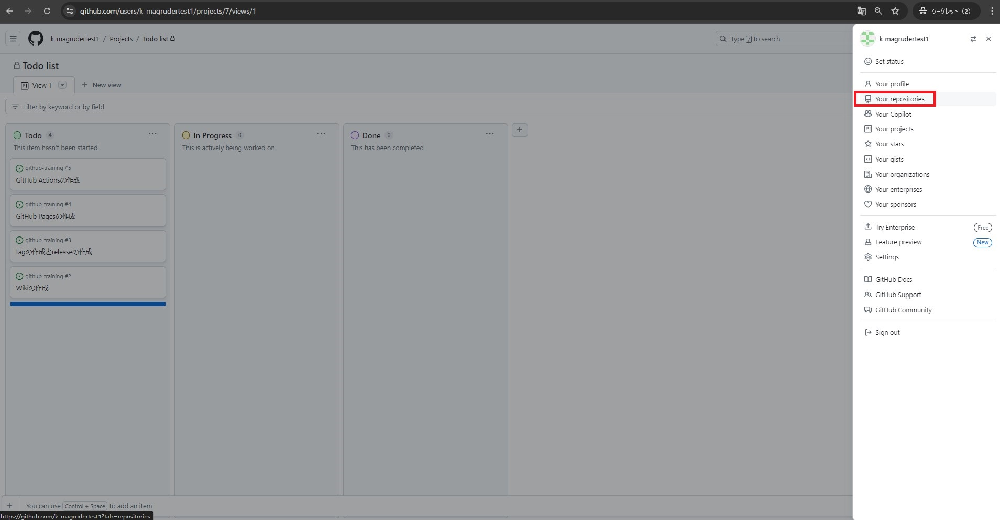
