ここでは、Wikiの作成を行います。(先の演習で作成したissueとprojectを用いてタスクを管理/実施するイメージも学んでいきます)    
また、GitHub Pagesの作成を行います。  
*ハンズオンの手順の参照とハンズオンの実施は、ブラウザで別タブか別ウィンドウを開いて行うことをおすすめします。

## 1. Wikiの作成

1. 「github-training」というRepositoryで作業します。
2. 画面の左上タブの「Project」をクリックします。
3. 「Todo list」をクリックします。(ブラウザで別タブか別ウィンドウを開くことをおすすめします)

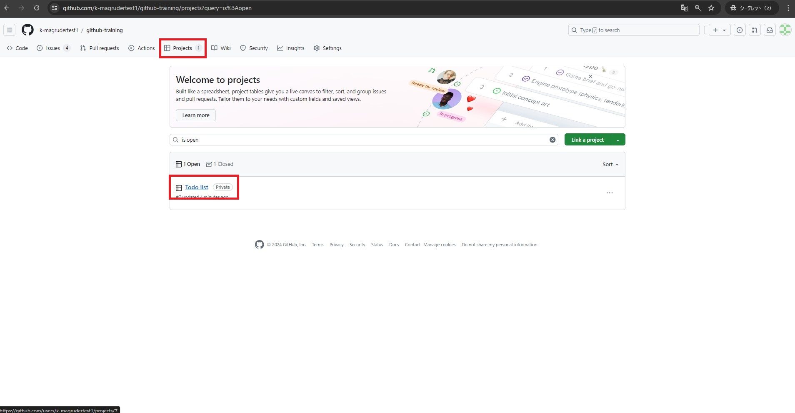

4. 「Todo」ステータスに存在する「Wikiの作成」というissueを、「In progress」にドラッグ&ドロップします。

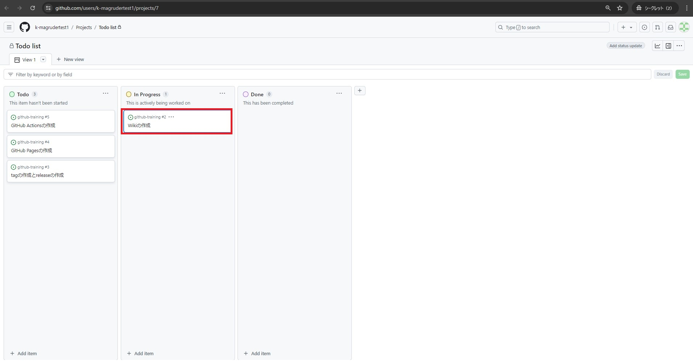

5. 「github-training」というRepositoryに戻ります。
6. 画面の左上タブの「Wiki」をクリックします。
7. 「Create the first page」をクリックします。

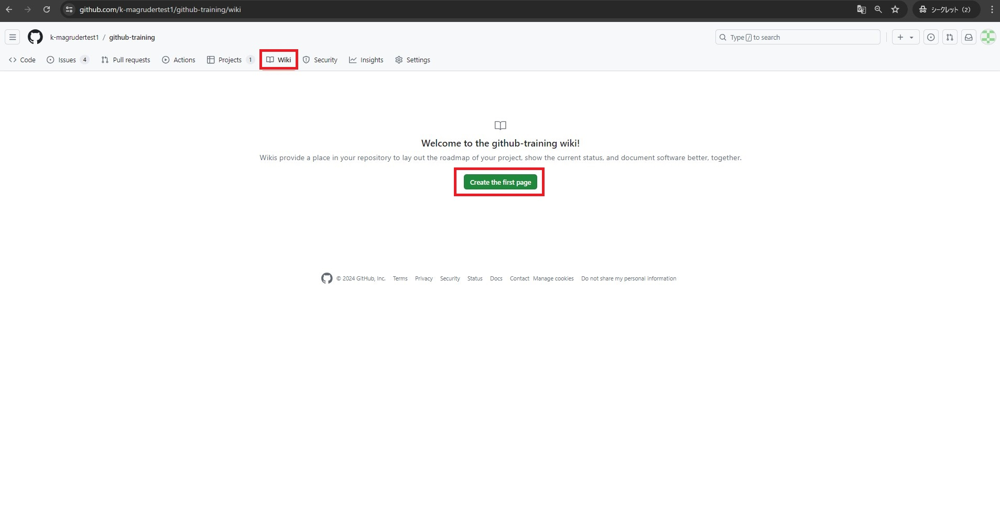

8. タイトルに `First time wiki` と入力します。
9. コンテンツとして以下のスニペットを入力します。(任意の内容を入力していただいても構いません)

```
_table of contents_

1. What is Wiki?
1. What is Wiki for?
1. Anything else?

## What is Wiki?

Wiki is a repository feature that allows users to create and share content in a collaborative and organized manner.

## What is Wiki for?

1. Documentation
1. Collablration

## Anything else?

**Just type and practice and learn Wiki!!**
```

10. 「Save page」をクリックします。

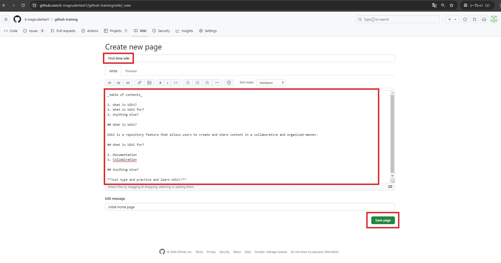

11. 作成したWikiページが確認できればokです。

12. 「Todo list」Projectの画面に戻り、「In progress」ステータスに存在する「Wikiの作成」というissueを、「Done」にドラッグ&ドロップします。

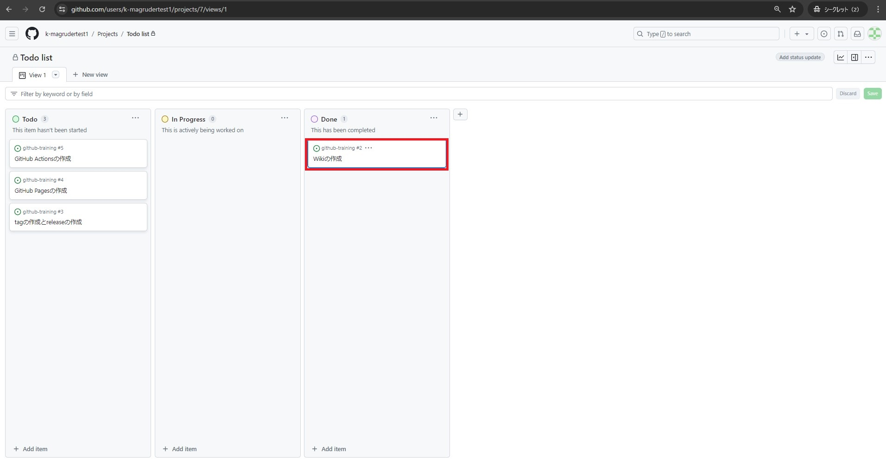

## 2. GitHub Pagesの作成

1. 「github-training」というRepositoryで作業します。
2. 画面の左上タブの「Project」をクリックします。
3. 「Todo list」をクリックします。(ブラウザで別タブか別ウィンドウを開くことをおすすめします)

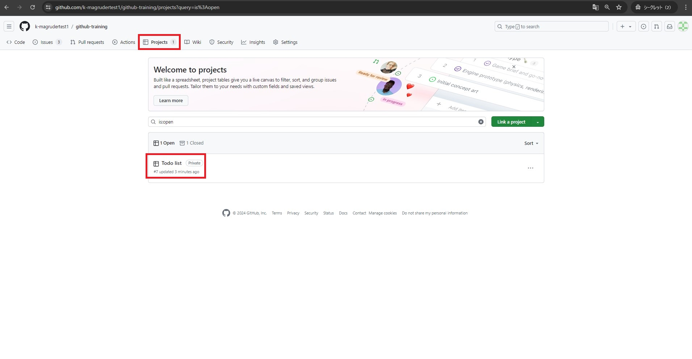

4. 「Todo」ステータスに存在する「GitHub Pagesの作成」というissueを、「In progress」にドラッグ&ドロップします。

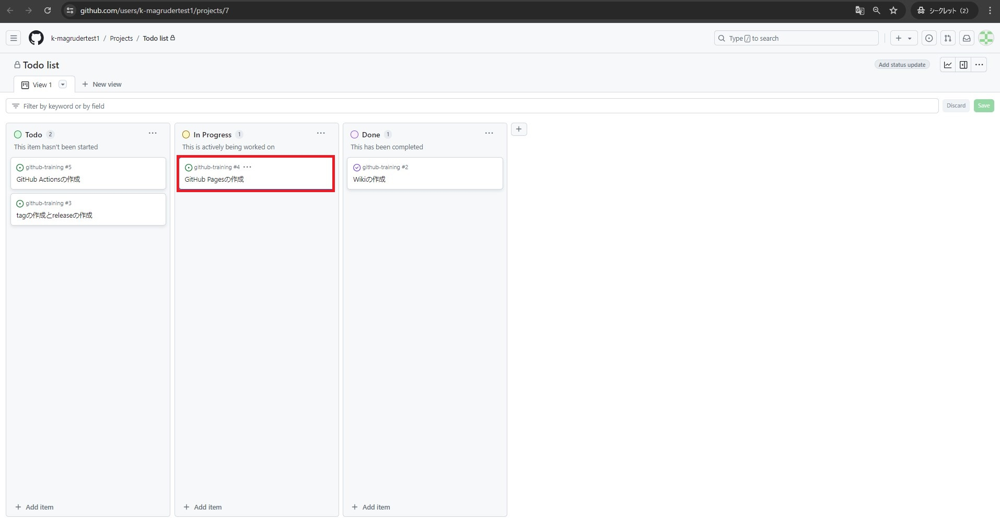

5. 「github-training」というRepositoryに戻ります。
6. 画面の左上タブの「<> Code」が選択されていることを確認してください。
7. 「Add file」をクリックし、「+ Create new file」をクリックします。

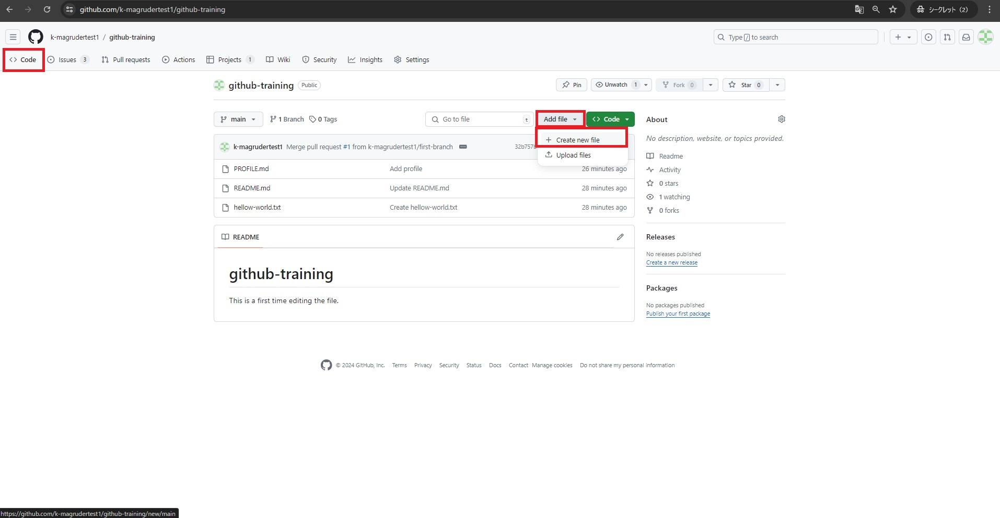

8. 「Name your file」に `docs/index.md` と入力します。
9. 「Enter file contents here」に以下のスニペットを入力します。(任意の内容を入力していただいても構いません)

```
## Test for GitHub Pages

My first GitHub Pages!
```

10. 追加するファイルの入力を終えたら、画面右上の「Commit changes...」をクリックします。
11. 「Commit changes」をクリックします。

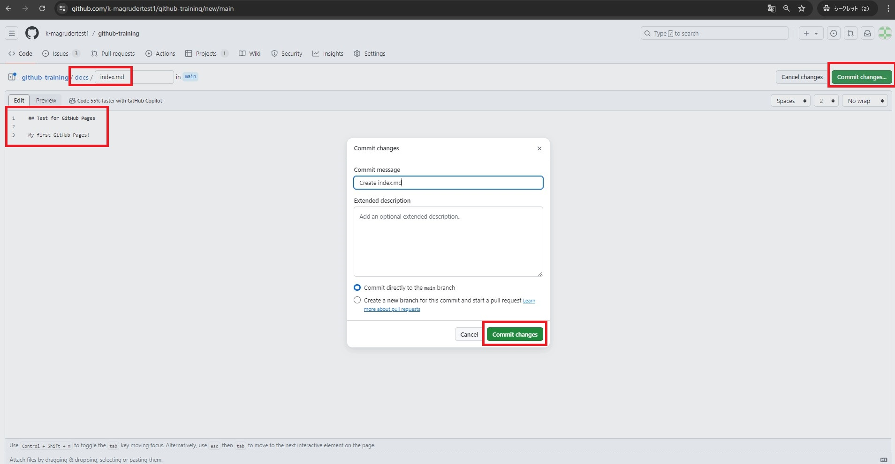

12. 画面の左上タブの「Settings」をクリックします。
13. 左のメニューのうち、「Pages」をクリックします。
14. Branchのセクションで、「None」をクリックし、「main」をクリックします。
15. 「/(root)」をクリックし、「/docs」をクリックします。
16. 「Save」をクリックします。

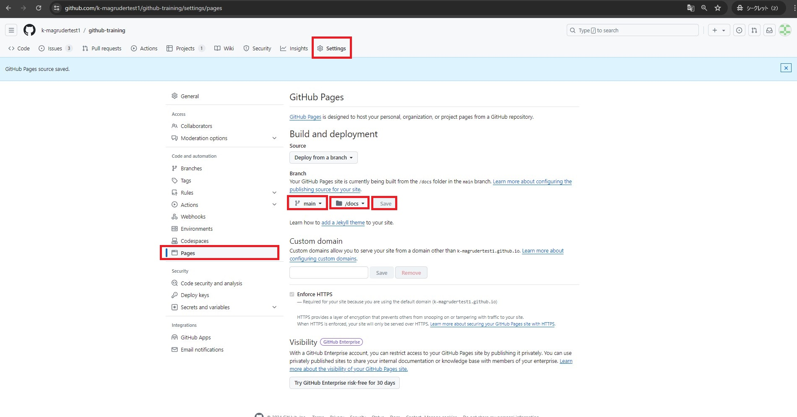

17. 「Build and deployment」のセクションの上に、「Your site live at https://,,,」と表示されたら、リンクをクリックします。(表示されない場合、一度ブラウザをリフレッシュしてください。ブラウザで別タブか別ウィンドウを開くことをおすすめします)

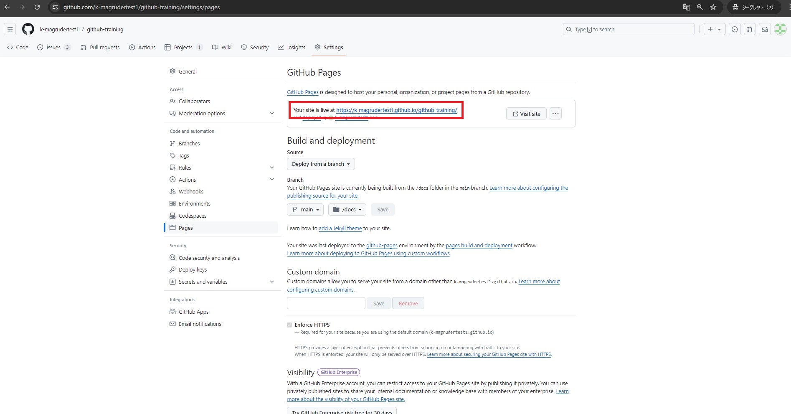

18. 以下のように表示されればokです。

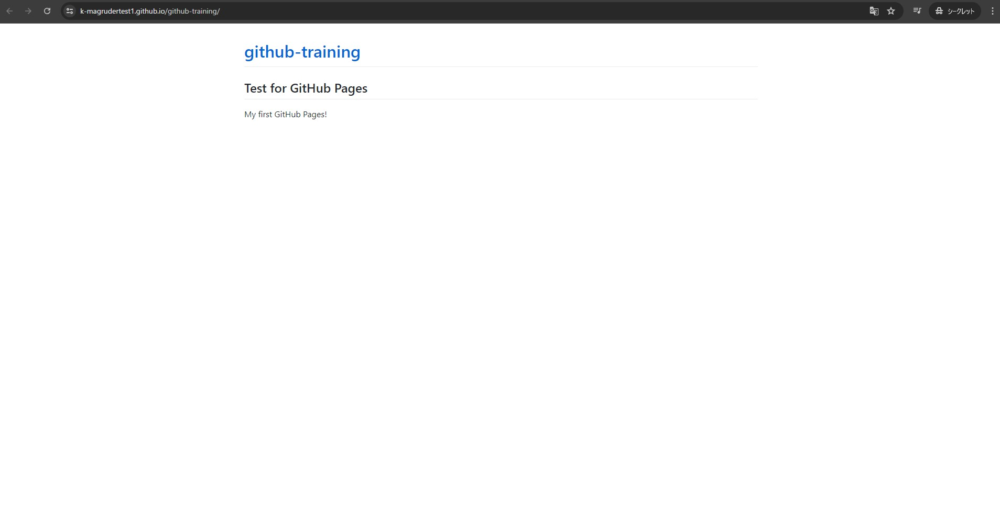

19. 「Todo list」Projectの画面に戻り、「In progress」ステータスに存在する「GitHub Pagesの作成」というissueを、「Done」にドラッグ&ドロップします。

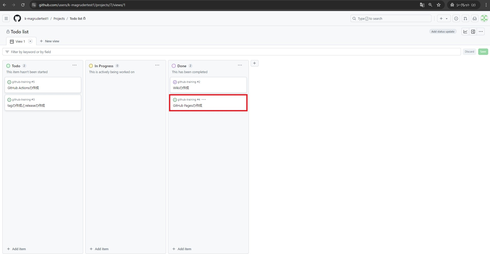
