## **この章のハンズオンは、オプションとなります。**

この章のハンズオンは、一部第5章のハンズオンを実施していることを前提としています。
第5章のハンズオンを実施していない場合、`(オプション)` と記載されている手順は飛ばしてください。

---

ここでは、releaseのドラフト作成及びtagの作成、branchを作成、新規コードのコミット、pull requestの作成、作成したbranchに実施した変更内容をmainにマージブランチへマージ、ドラフト作成したreleaseを公開までを行います。(先の演習で作成したissueとprojectを用いてタスクを管理/実施するイメージも学んでいきます)  
*ハンズオンの手順の参照とハンズオンの実施は、ブラウザで別タブか別ウィンドウを開いて行うことをおすすめします。

## 1. releaseのドラフト作成及びtagの作成

1. `(オプション)` 「github-training」というRepositoryで作業します。
2. `(オプション)` 画面の左上タブの「Project」をクリックします。
3. `(オプション)` 「Todo list」をクリックします。(ブラウザで別タブか別ウィンドウを開くことをおすすめします)

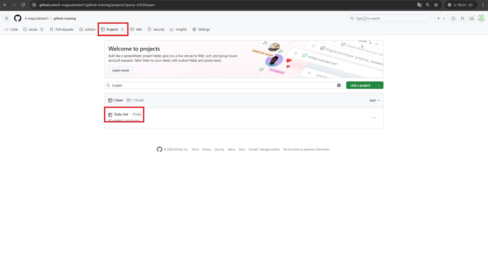

4. `(オプション)` 「Todo」ステータスに存在する「tagの作成とreleaseの作成」というissueを、「In progress」にドラッグ&ドロップします。

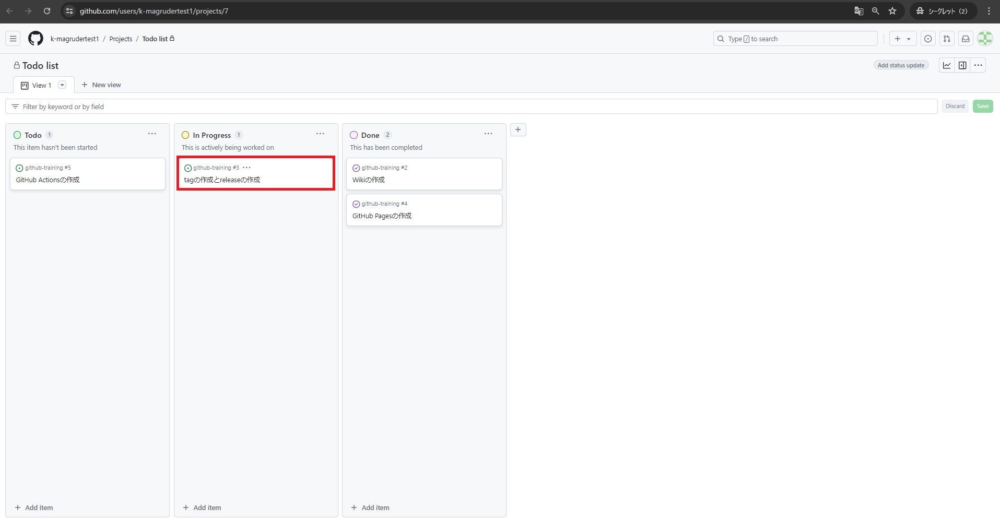

5. 「github-training」というRepositoryに戻ります。
6. 画面の左上タブの「<> Code」が選択されていることを確認してください。
7. 画面の右側の「Release」をクリックします。

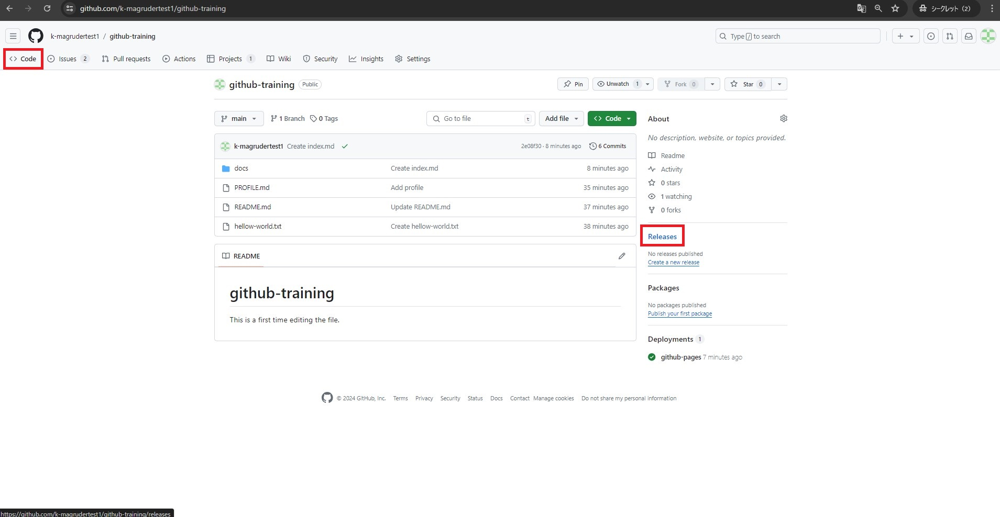

8. 「Create a new release」をクリックします。

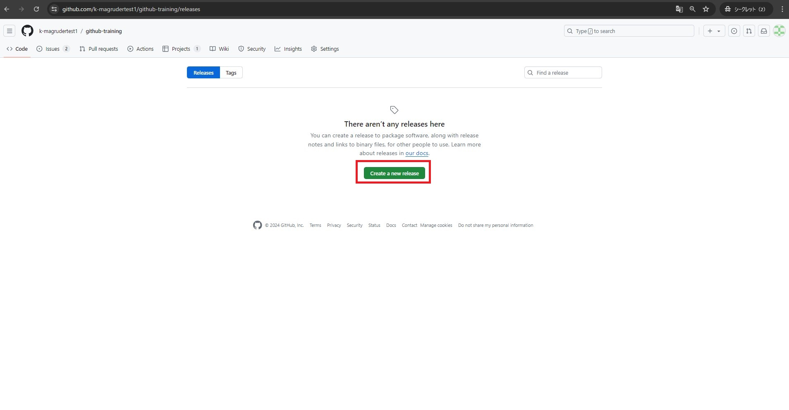

9. 「Release title」に `v1.0.0` と入力します。 
10. 「Describe the release」に `Really first release!` と入力します。
11. 「Choose a tag」をクリックし、`v1.0.0` と入力します。
12. 「Create new tag: v1.0.0 on publish」をクリックします。
13. 「Save draft」をクリックします。(画面が切り替わらなくてもokです)
14. 画面の左上タブの「<> Code」をクリックします。

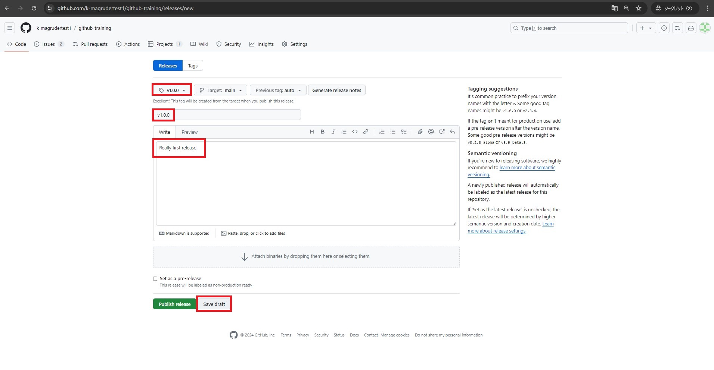

## 2. branchを作成し、コードをコミット、pull requestの作成とマージ

1. 「github-training」というRepositoryで作業します。
2. 画面の左上タブの「<> Code」が選択されていることを確認してください。
3. 「main」と表示されている部分をクリックします。
4. 「Find or create a branch」に `my-first-code` と入力します。
5. 「Create branch *my-first-code* from *main*」をクリックします。

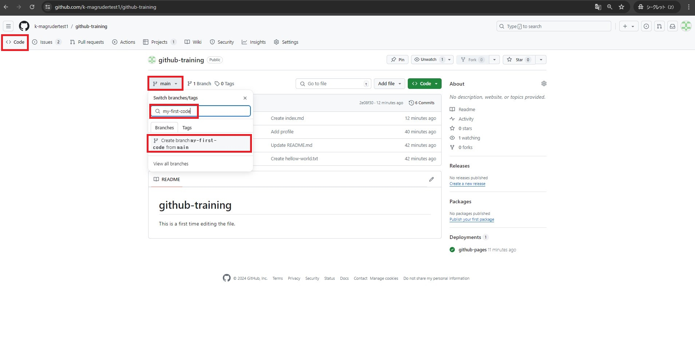

6. 「my-first-code」が選択されていることを確認してください。
7. 「Add file」をクリックし、「+ Create new file」をクリックします。

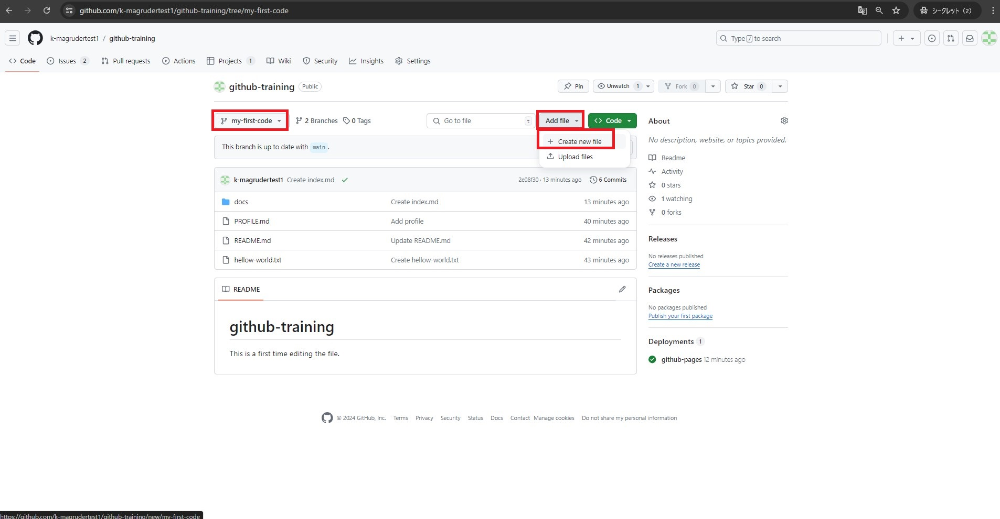

8. 「Name your file」に `main.py` と入力します。
9. 「Enter file contents here」に以下のスニペットを入力します。

```
## This program prints "Hello world!".

print('Hellow world!')
```

10. 追加するファイルの入力を終えたら、画面右上の「Commit changes...」をクリックします。
11. 「Commit directly to the my-first-code branch」が選択されていることを確認します。
12. 「Commit changes」をクリックします。

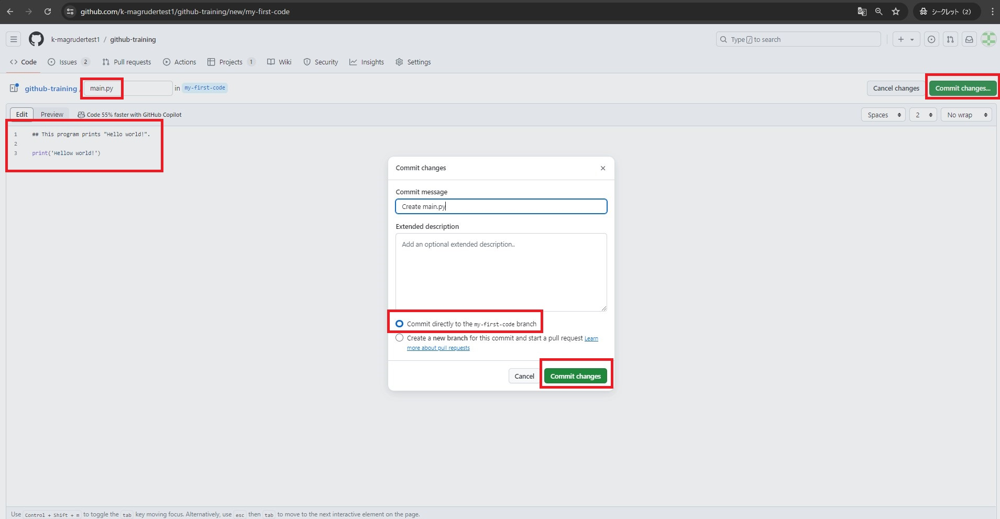

13. 画面の左上タブの「Pull requests」をクリックします。
14. 「Compare & pull request」をクリックします。

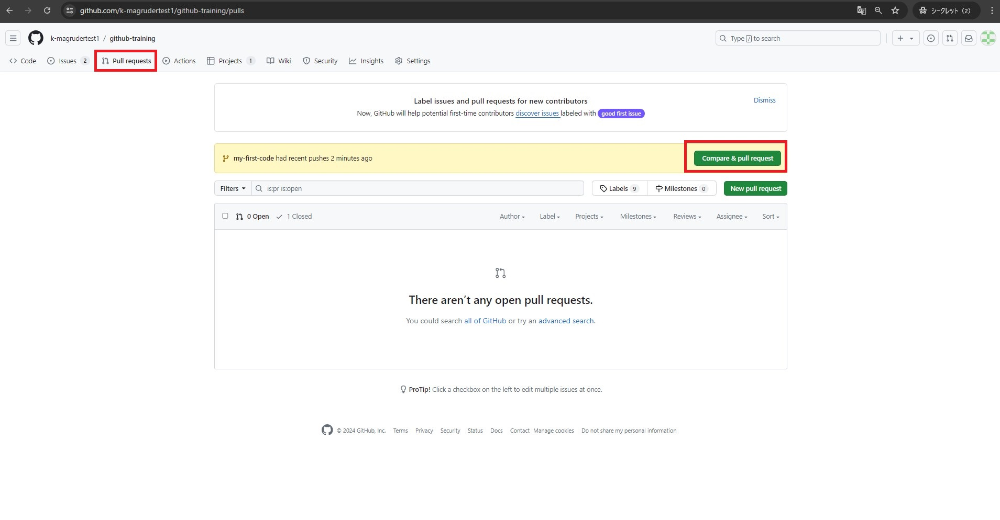

15. 「Create pull request」をクリックします。

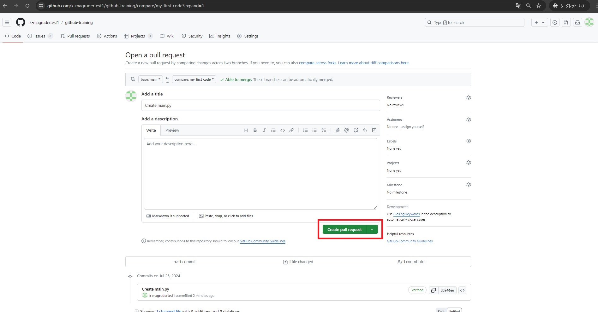

16. `(オプション)` 画面右側の「Development」をクリックし、「tagの作成とreleaseの作成」をクリックします。(チェックが入ったら、カーソルを外に移動しクリックします)
*これにより、作成したpull requestがクローズされると、「tagの作成とreleaseの作成」というissueが自動的にDoneステータスに移動します。(あとで確認します)

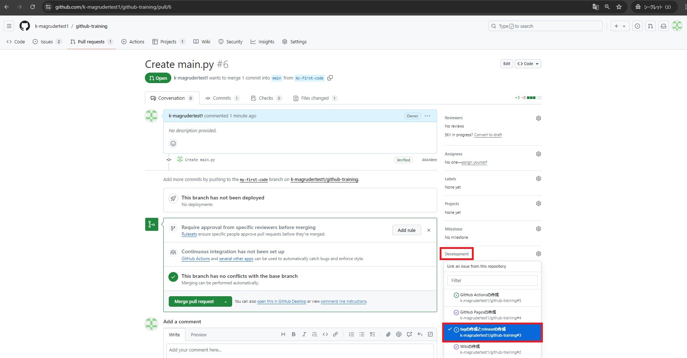

17. 「Merge pull request」をクリックします。

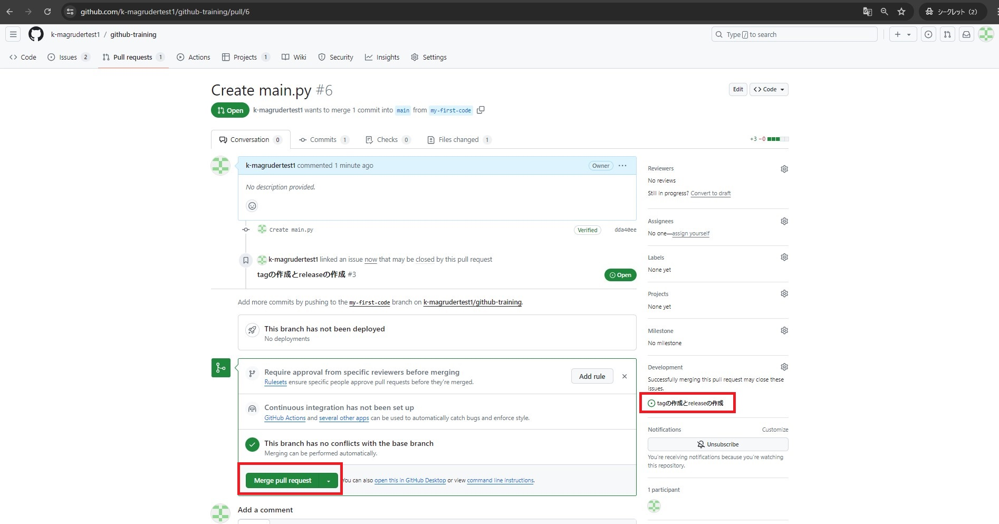

18. 「Confirm merge」をクリックします。

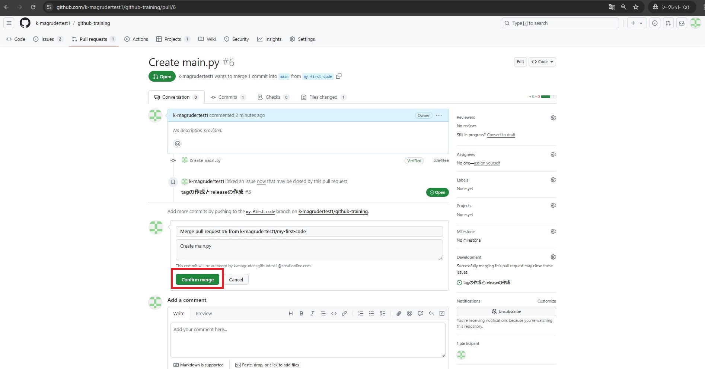

19. 「Delete branch」をクリックします。

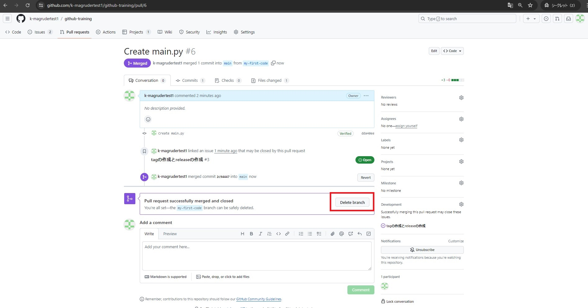

20. 画面の左上タブの「<> Code」をクリックします。

## 3. ドラフト作成したreleaseを公開

1. 「github-training」というRepositoryで作業します。
2. 画面の左上タブの「<> Code」が選択されていることを確認してください。
3. 画面の右側の「Release」をクリックします。

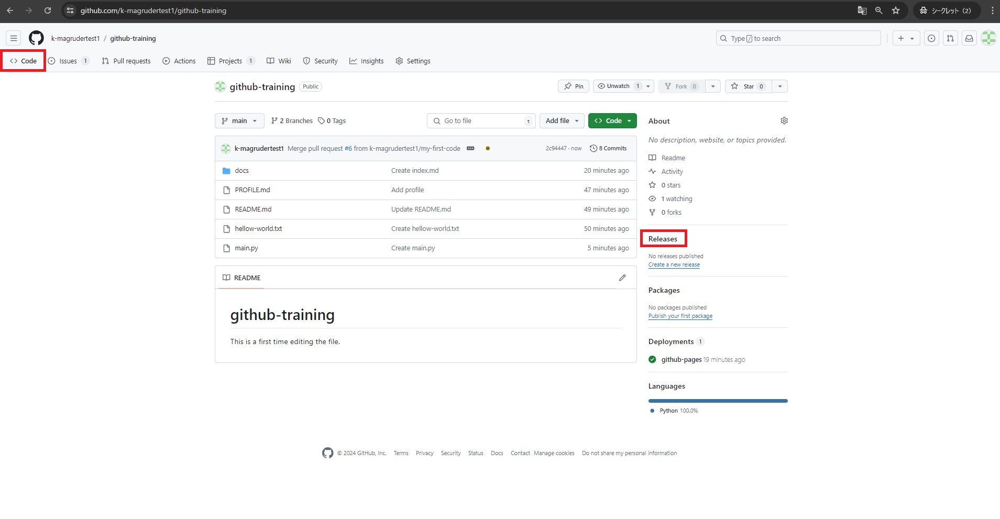

4. 「v1.0.0 Draft」と表示されているreleaseの鉛筆マークをクリックします。

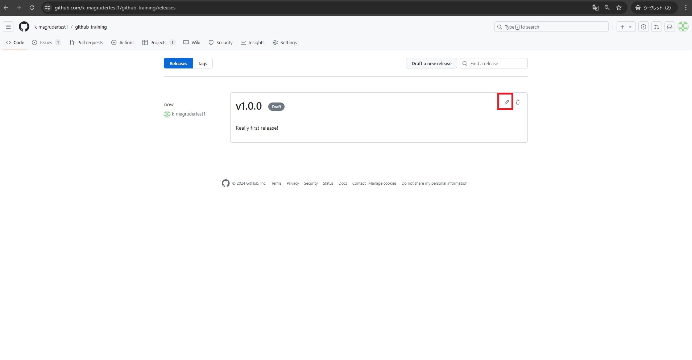

5. 「Publish release」をクリックします。

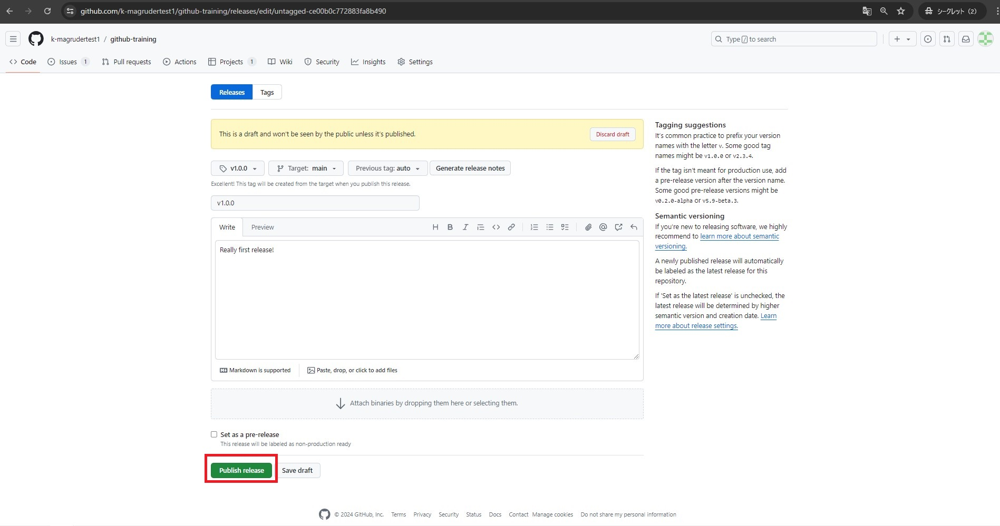

6. 「v1.0.0」の公開ができました。(「Assets」が表示されていることが確認できます)

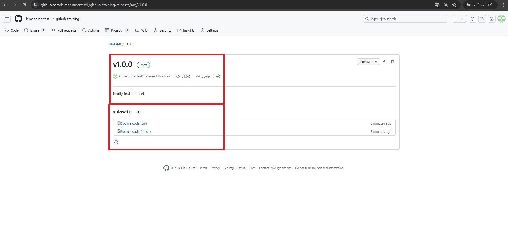

7. `(オプション)` 「Todo list」Projectの画面に戻ります。
8. `(オプション)` 「In progress」ステータスに存在する「tagの作成とreleaseの作成」というissueが、「Done」に既に移動していることが確認できます。(先述の通り、先ほど作成したpull requestがクローズされたため、「tagの作成とreleaseの作成」というissueが自動的にDoneステータスに移動したことがわかります。)

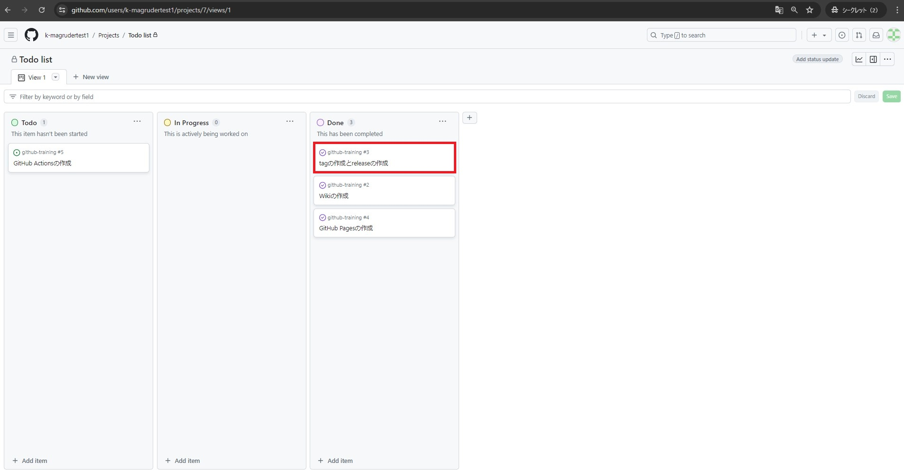
