ここでは、ブランチを作成し、GitHub Actionsを定義したYamlファイルを追加、pull requestの作成、作成したbranchに実施した変更内容をmainにマージブランチへマージまでを行います。(先の演習で作成したissueとprojectを用いてタスクを管理/実施するイメージも学んでいきます) 
*ハンズオンの手順の参照とハンズオンの実施は、ブラウザで別タブか別ウィンドウを開いて行うことをおすすめします。

## 1. branchを作成し、GitHub Actionsを定義したYamlファイルを追加、pull requestの作成とマージ

1. 「github-training」というRepositoryで作業します。
2. 画面の左上タブの「Project」をクリックします。
3. 「Todo list」をクリックします。(ブラウザで別タブか別ウィンドウを開くことをおすすめします)

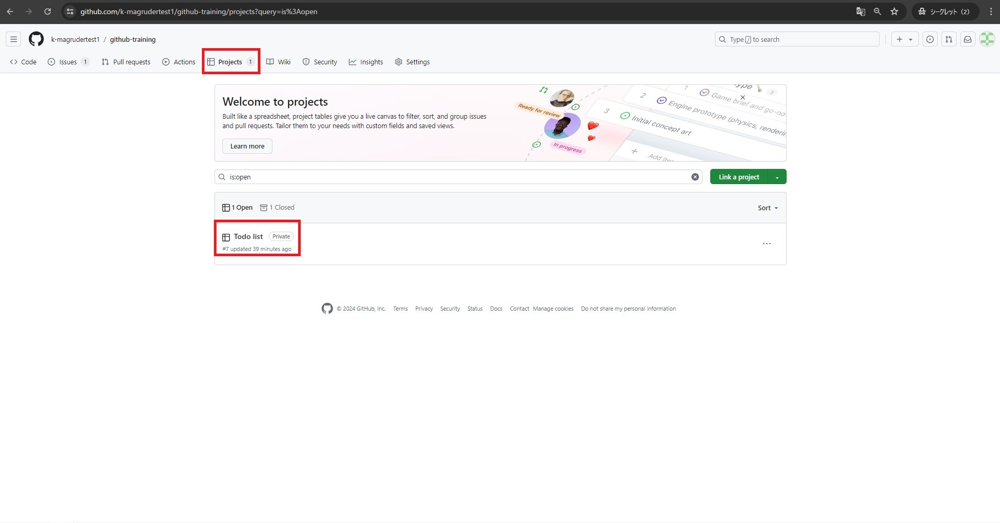

4. 「Todo」ステータスに存在する「GitHub Actionsの作成」というissueを、「In progress」にドラッグ&ドロップします。

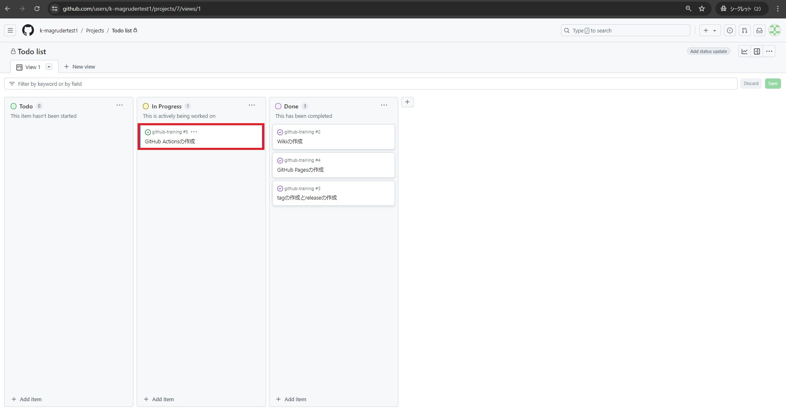

5. 「github-training」というRepositoryに戻ります。
6. 画面の左上タブの「<> Code」が選択されていることを確認してください。
7. 「main」と表示されている部分をクリックします。
8. 「Find or create a branch」に `my-first-workflow` と入力します。
9. 「Create branch *my-first-workflow*」をクリックします。

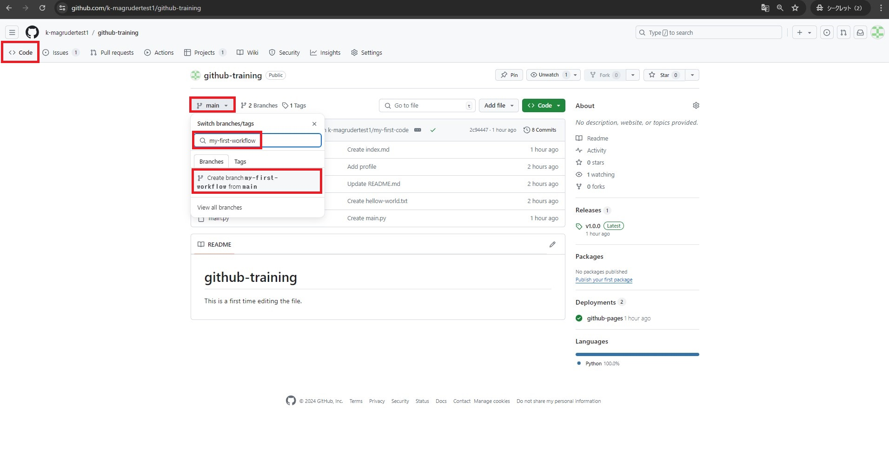

10. 「my-first-workflow」が選択されていることを確認してください。
11. 「Add file」をクリックし、「+ Create new file」をクリックします。

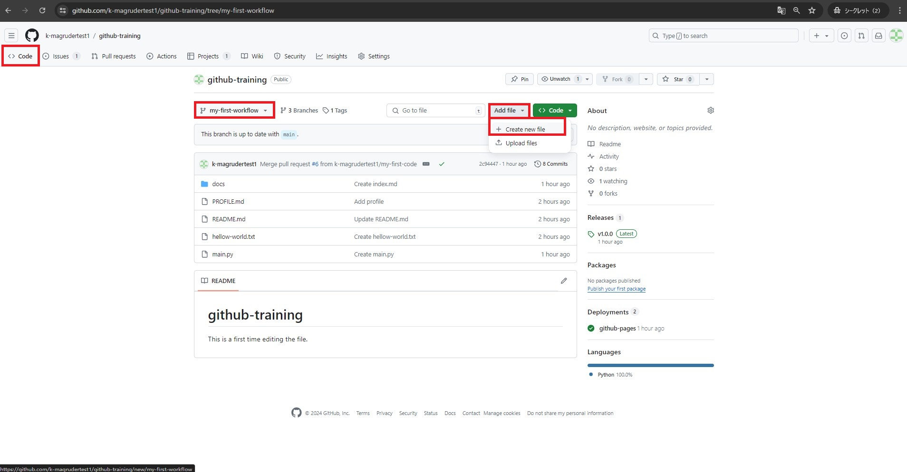

12. 「Name your file」に `.github/workflows/sample.yml` と入力します。
13. 「Enter file contents here」に以下のスニペットを入力します。

```
name: Sample Workflow

on: 
  push:
    branches:
      - main

jobs:
  build:
    runs-on: ubuntu-latest
    steps:
    - name: execute "build job" with echo command
      run: echo "build job"

  test:
    runs-on: ubuntu-latest
    needs: build
    steps:
    - name: execute "sast test" with echo command
      run: echo "sast test"
    - name: execute "linter test" with echo command
      run: echo "linter test"

  deploy:
    runs-on: ubuntu-latest
    needs: test
    steps:
    - name: execute "deploy job" with echo command
      run: echo "deploy job"
```

14. 追加するファイルの入力を終えたら、画面右上の「Commit changes...」をクリックします。
15. 「Commit directly to the my-first-workflow branch」が選択されていることを確認します。
16. 「Commit changes」をクリックします。

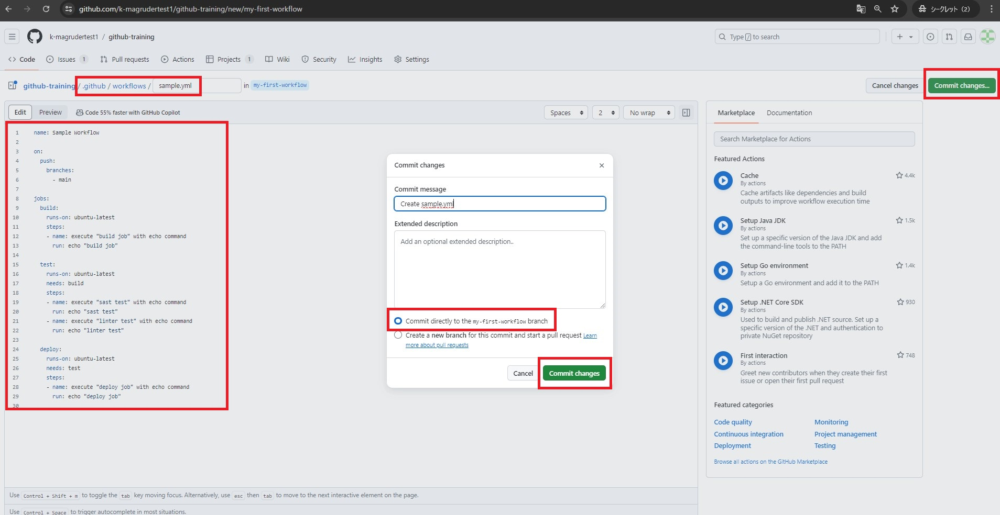

17. 画面の左上タブの「Pull requests」をクリックします。
18. 「Compare & pull request」をクリックします。

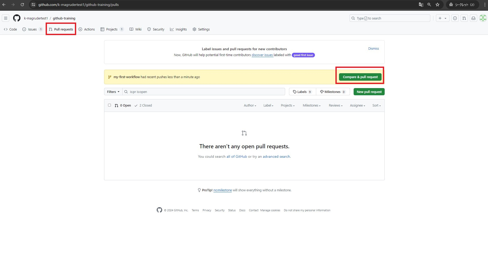

19. 「Create pull request」をクリックします。

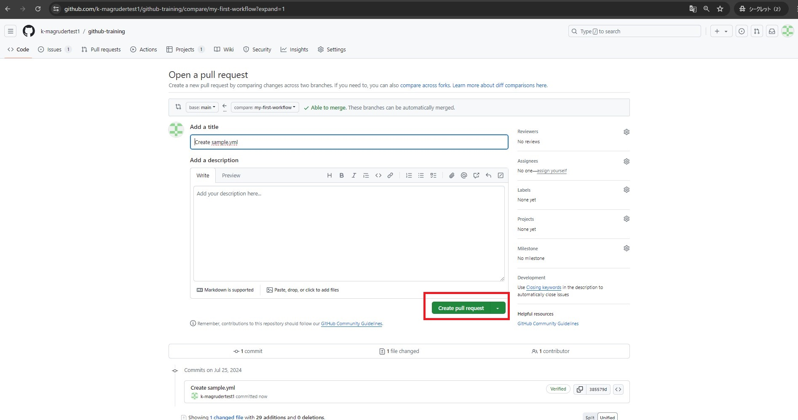

20. 画面右側の「Development」をクリックし、「GitHub Actionsの作成」をクリックします。(チェックが入ったら、カーソルを外に移動しクリックします)
*これにより、作成したpull requestがクローズされると、「GitHub Actionsの作成」というissueが自動的にDoneステータスに移動します。(あとで確認します)

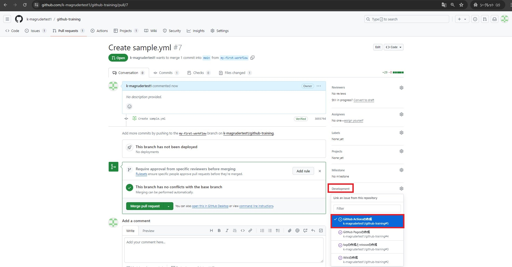

21. 「Merge pull request」をクリックします。

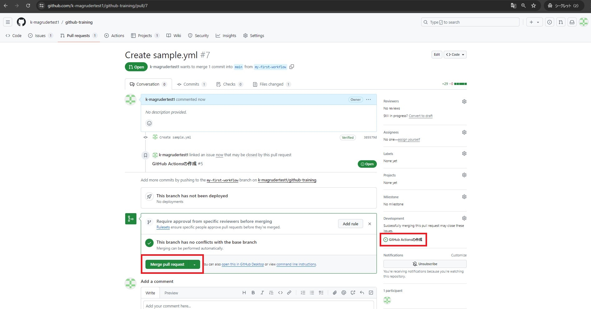

22. 「Confirm merge」をクリックします。

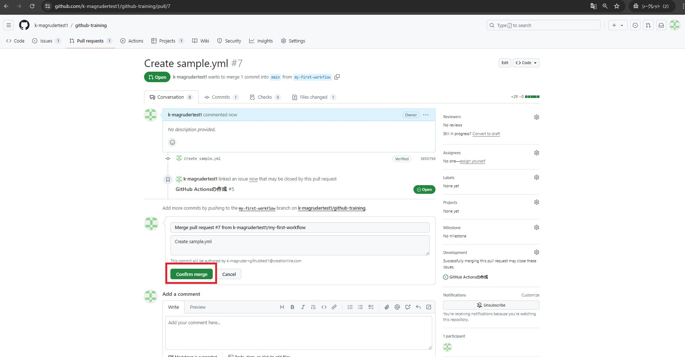

23. 「Delete branch」をクリックします。

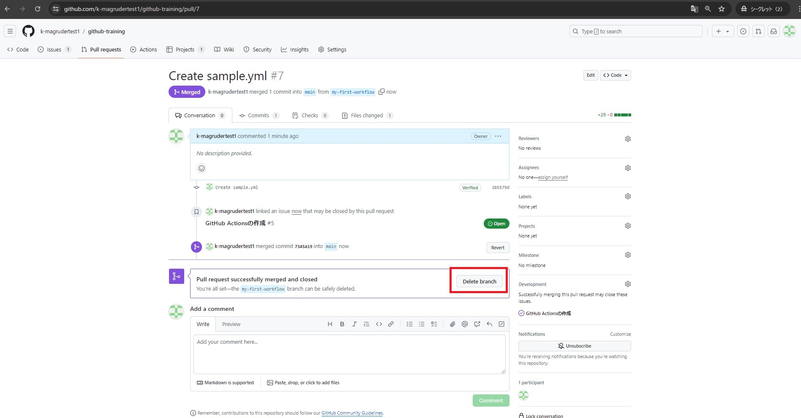

24. 画面の左上タブの「Actions」をクリックします。
25. 「Merge pull reqest #,,,,」をクリックします。

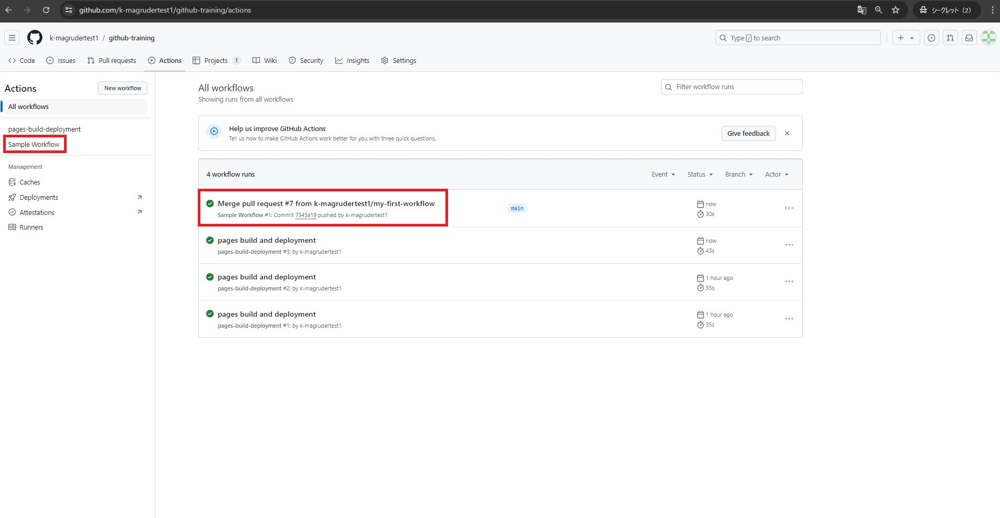

26. 以下のように表示されればokです。

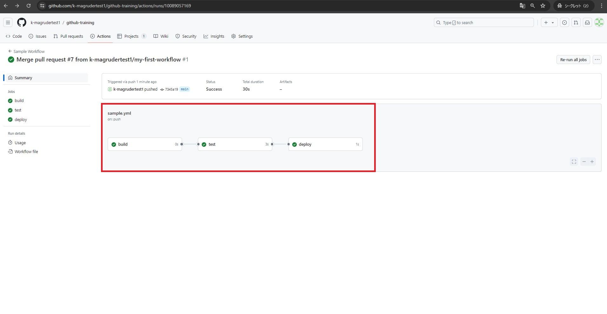

27. 「Todo list」Projectの画面に戻ります。
28. 「In progress」ステータスに存在する「GitHub Actionsの作成」というissueが、「Done」に既に移動していることが確認できます。(先述の通り、先ほど作成したpull requestがクローズされたため、「GitHub Actionsの作成」というissueが自動的にDoneステータスに移動したことがわかります。)

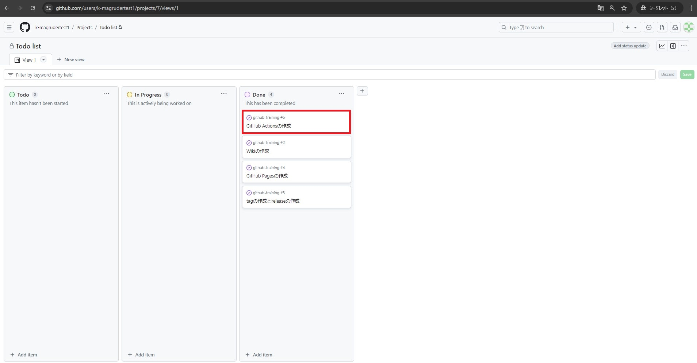

29. これで、「Todo list」に存在したissue(タスク)をすべて完了しました。
